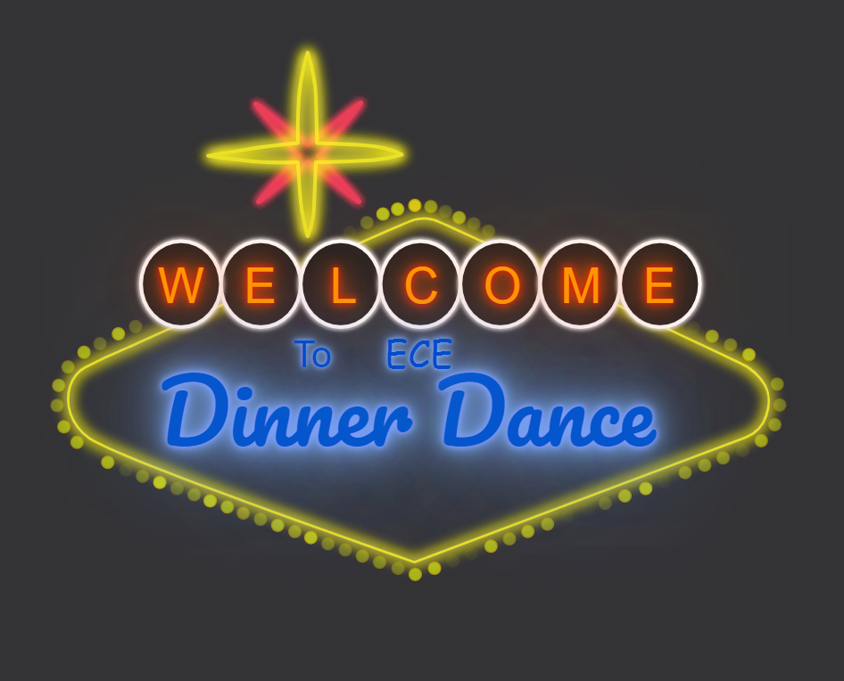
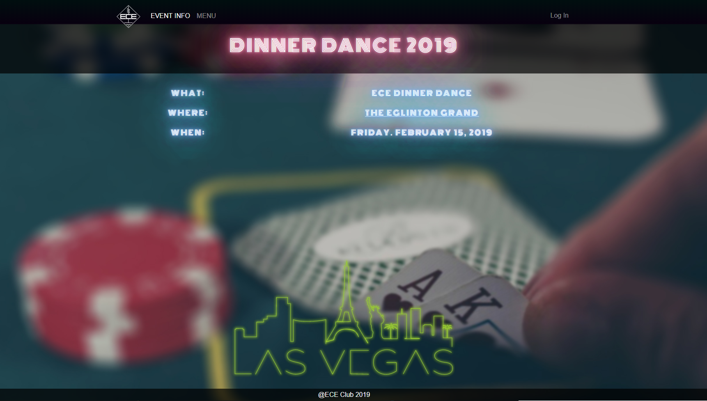
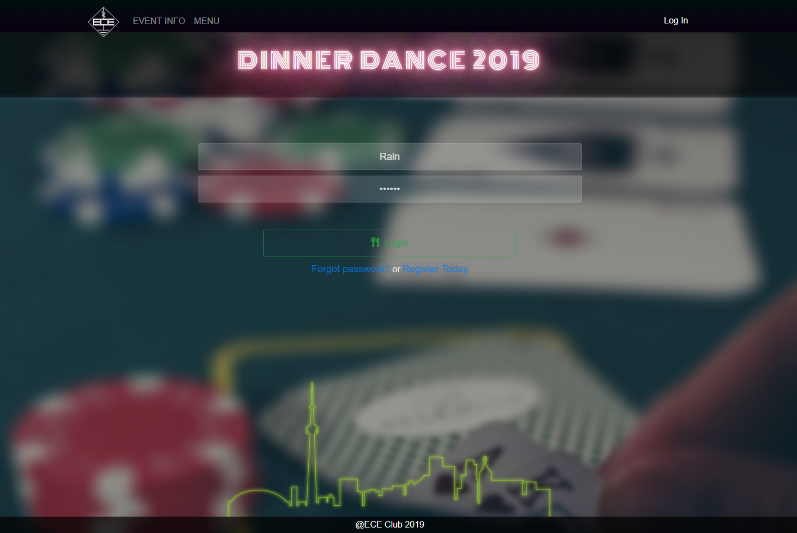
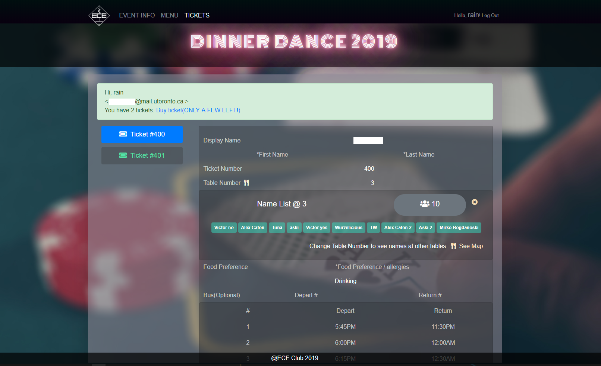
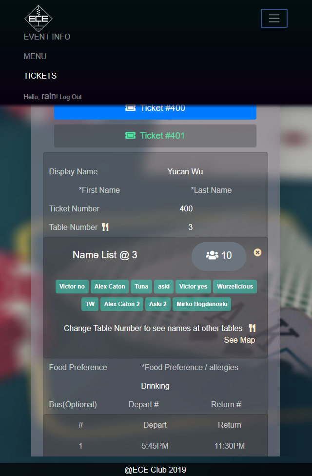

# Dinner Dance Website

This is the website of the 2019 University of Toronto Electrical & Computer Engineering Club Dinner Dance. 

## Website Link

<a href="https://ece.skule.ca/dinner"> CLICK HERE </a> (https://ece.skule.ca/dinner)

### Preview

#### <a href="https://ece.skule.ca/dinner"> Index page </a>

#### <a href="https://ece.skule.ca/dinner/page_eventinfo.php"> Event Information page </a>

#### <a href="https://ece.skule.ca/dinner/page_login.php"> User Login page </a>

#### <a href="https://ece.skule.ca/dinner/page_info.php"> Tickets Information Login page </a>

## Deployment

1. Setup database with sql file in the sql folder
2. You are ready to go!

## Built With

* [PHP5](https://www.php.net/manual/en/function.phpversion.php)
* [HTML5](https://developer.mozilla.org/en-US/docs/Web/Guide/HTML/HTML5)
* [CSS3](https://developer.mozilla.org/en-US/docs/Web/CSS/CSS3)
* [JavaScript](https://developer.mozilla.org/en-US/docs/Web/JavaScript)
* [Bootstrap](https://getbootstrap.com/)
* [ircmaxell/password_compat](https://github.com/ircmaxell/password_compat) A Compatibility library with PHP 5.5's simplified password hashing API.

## Authors

* **Yucan Wu** - *Initial work* - [Raindroid](https://github.com/raindroid)
* **Xinru Li** - *Initial work* - [ErinLxr](https://github.com/ErinLxr)

## License

This project is licensed under the MIT License - see the [LICENSE.md](LICENSE.md) file for details
